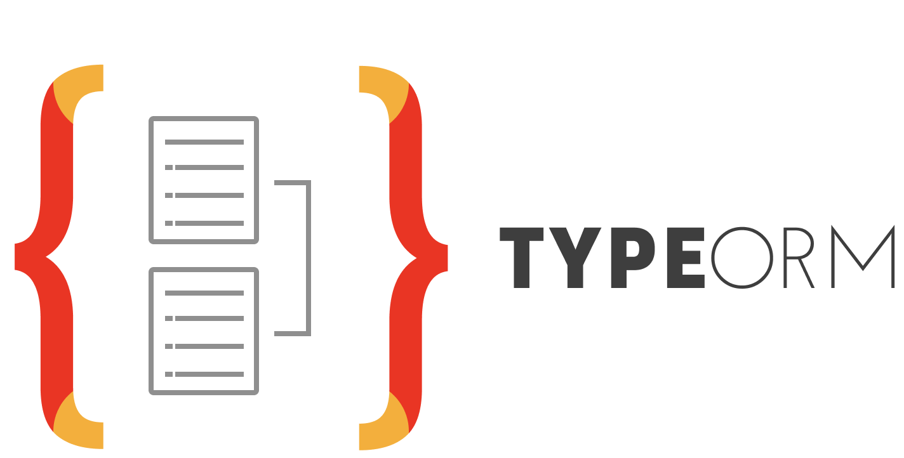

# Sahti

Sahti is a website which aims to organize the tunisian sanitary domain by providing the necessary functionalities for all tiers (Patients, Doctors, Technicians,
Pharmacists
etc...)

## Tech Stack

<div style="width:80%; margin:0 auto;">
  

  
  
  
  
</div>

## Environment Variables

To run this project, create `.env` file, copy the `.example.env` file into your `.env` file, and change the following value of the following variable to the appropriate one.

`JWT_VERIFICATION_TOKEN_SECRET`

`JWT_LOGIN_TOKEN_SECRET`

`JWT_RESET_TOKEN_SECRET`

`MAIL_PASSWORD`

## Run Locally

1- Make sure you have docker and docker-compose installed in your system by running these commands:
```bash
docker --version
docker-compose --version
```
2- Clone the project

```bash
  git clone https://github.com/AhmedGrati/sahti-backend
```

3- Go to the project directory

```bash
  cd sahti-backend
```

4- Run the project

```bash
  docker-compose up
```
## License

The source code for the site is licensed under the [MIT](https://choosealicense.com/licenses/mit/) license, which you can find in the LICENSE.txt file. 
